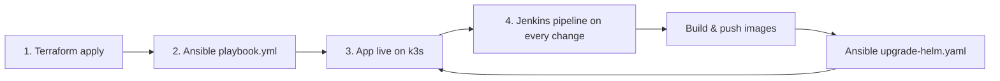

# Baytak Foundation Management — DevOps

Charity operations platform (donors, funds, custody, expenses, reports) deployed on a **single-node k3s cluster** on AWS EC2.

**Stack:** Terraform → Ansible → Helm/k3s → Jenkins CI/CD

---

## Architecture overview

```text
┌─────────────────────────────────────────────────────────────────────────┐
│                     Jenkins Master (control plane VM)                   │
│         runs Terraform + Ansible + builds Docker images                 │
│                                                                         │
│   Git commit / SCM poll                                                 │
│        │                                                                │
│        ▼                                                                │
│   Checkout → Docker Login → Build FE/BE (parallel) → Verify             │
│        → Push FE/BE (parallel) → ansible-playbook upgrade-helm.yaml     │
└───────────────────────────────┬─────────────────────────────────────────┘
                                │ SSH + Ansible Vault
                                ▼
┌─────────────────────────────────────────────────────────────────────────┐
│                    AWS EC2 (Ubuntu 24.04) — single node                 │
│                                                                         │
│   Terraform provisions: EC2 · IAM role/profile · Security Group · Key   │
│                                                                         │
│   Ansible installs:                                                     │
│     docker · git · helm · k3s · nginx-ingress · cert-manager            │
│     alertmanager · prometheus · grafana                                 │
│     transfer_files (clone repo + first Helm deploy)                     │
│                                                                         │
│   ┌─────────────────────────── k3s ─────────────────────────────────┐   │
│   │  Namespace: baytak                                              │   │
│   │    Frontend · Backend · Postgres · Ingress · cert-manager TLS   │   │
│   │  Namespace: monitoring                                          │   │
│   │    Prometheus · Grafana · Alertmanager                          │   │
│   │  Namespace: ingress-nginx                                       │   │
│   │    NGINX Ingress (NodePorts 31080 / 31443)                      │   │
│   └─────────────────────────────────────────────────────────────────┘   │
└─────────────────────────────────────────────────────────────────────────┘
                                │
                                ▼
                         Docker Hub
                   abdelwahabadam/baytak
```

### Why k3s?

Free-tier / single-node EC2 needs a lightweight Kubernetes. **k3s** gives standard Kubernetes APIs (Deployments, Services, Ingress, Helm) with a small footprint—ideal for one node without a full control-plane HA cluster.

---

## Repository layout

```text
├── terraform/          # AWS: EC2, IAM, SG, key pair, Ansible inventory
├── ansible/            # Bootstrap + platform + Helm deploy/upgrade
│   ├── playbook.yml           # First-time server setup
│   ├── upgrade-helm.yaml      # CI/CD Helm upgrade
│   ├── group_vars/all/vault.yml
│   └── roles/                 # One role per component (tasks, vars, handlers, …)
├── helm/               # Application chart "Baytak"
├── Jenkinsfile         # Build → push → deploy pipeline
├── backend/            # FastAPI + Dockerfile
├── frontend/           # React/Vite + Dockerfile
└── compose.yaml        # Optional local MVP (no cloud)
```

---

## Plan (end-to-end)



| Step | Tool | What happens |
|------|------|----------------|
| 1 | **Terraform** | Creates EC2, IAM role/instance profile, security group, SSH key; writes `ansible/inventory.ini` |
| 2 | **Ansible** `playbook.yml` | Installs platform stack; last role clones the repo and Helm-installs the app |
| 3 | **Helm / k3s** | Runs frontend, backend, Postgres, ingress, TLS, monitoring |
| 4 | **Jenkins** | On new commits: build/tag/push images, then Helm upgrade via Ansible + vault |

---

## Infrastructure (Terraform)

**Region (default):** `eu-central-1`

| Resource | Purpose |
|----------|---------|
| EC2 (Ubuntu 24.04) | Single host for k3s + app |
| IAM role + instance profile | EC2 identity |
| Security group `baytak-sg` | Ports **22**, **80**, **443**, **31080**, **31443** |
| Key pair | SSH from Jenkins / operators |
| `local_file` inventory | Generates `ansible/inventory.ini` with the public IP |

```text
terraform/
  main.tf · variables.tf · data.tf · key_pair.tf
  security_group.tf · iam.tf · ec2.tf · outputs.tf
  inventory.tf · ansible_inventory.tpl
```

### Provision

```bash
cd terraform

# Create terraform.tfvars (gitignored), for example:
#   aws_region      = "eu-central-1"
#   project_name    = "baytak"
#   environment     = "production"
#   instance_type   = "t3.micro"   # or your chosen size
#   key_pair_name   = "baytak"
#   public_key_path = "~/.ssh/baytak.pub"
#   ssh_cidr        = "YOUR.IP.0.0/32"

terraform init
terraform plan
terraform apply
```

Outputs include public IP/DNS. Inventory is written to `../ansible/inventory.ini`:

```ini
[baytak]
<public_ip> ansible_user=ubuntu
```

---

## Configuration (Ansible)

Each role owns its **tasks**, **vars**, **handlers**, **defaults**, and templates where needed.

### Bootstrap playbook (`ansible/playbook.yml`)

Runs on the EC2 host after Terraform:

| Order | Role | Installs / does |
|------:|------|------------------|
| 1 | `python` | System Python + `/opt/ansible-venv` |
| 2 | `docker` | Docker CE |
| 3 | `git` | Git |
| 4 | `helm` | Helm 3 |
| 5 | `k3s` | k3s server (`--docker`, Traefik disabled) |
| 6 | `nginx-ingress` | Ingress NGINX (NodePorts 31080/31443) |
| 7 | `cert-manager` | Jetstack cert-manager + CRDs |
| 8 | `alertmanager` | Alertmanager (monitoring) |
| 9 | `prometheus` | Prometheus (monitoring) |
| 10 | `grafana` | Grafana (monitoring) |
| 11 | `transfer_files` | Clone repo → `/opt/baytak` · first **Helm install** |

Secrets come from **Ansible Vault** (`ansible/group_vars/all/vault.yml`): DB, JWT, bootstrap admin, SMTP, Docker Hub credentials.

### First-time configure

From the Jenkins/control VM (SSH key must reach the instance as `ubuntu`):

```bash
cd ansible   # or set ANSIBLE_CONFIG=ansible/ansible.cfg from repo root

# Decrypt vault with your password file
ansible-playbook playbook.yml \
  -i inventory.ini \
  --vault-password-file /path/to/vault_pass
```

> Ensure `vars_files` points at `group_vars/all/vault.yml` (vault lives under `group_vars/all/`).

### CI upgrade playbook (`ansible/upgrade-helm.yaml`)

Used by Jenkins after images are pushed:

- Release: `baytak`
- Chart: `/opt/baytak/helm`
- Namespace: `baytak`
- Extra vars: `backend_tag`, `frontend_tag` (e.g. `backend-42`, `frontend-42`)
- Injects vault secrets into Helm values and waits for rollouts

```bash
export ANSIBLE_CONFIG=ansible/ansible.cfg
ansible-playbook ansible/upgrade-helm.yaml \
  -i ansible/inventory.ini \
  --vault-password-file .vault_pass \
  -e backend_tag=backend-<BUILD_NUMBER> \
  -e frontend_tag=frontend-<BUILD_NUMBER>
```

---

## Application on Kubernetes (Helm)

Chart: `helm/` (name **Baytak**)

```text
Namespace baytak
  ├── frontend Deployment + Service
  ├── backend Deployment + Service + ConfigMap + Secret
  ├── postgres Deployment + Service + PV/PVC
  ├── Ingress (nginx) + Let's Encrypt issuer
  └── Docker Hub pull secret (regcred)
```

Images: `abdelwahabadam/baytak:backend-*` and `abdelwahabadam/baytak:frontend-*`

---

## CI/CD (Jenkins)

**Jenkins master** = the VM that runs Terraform and Ansible.

```text
Git commit
    │
    ▼
┌──────────┐   ┌──────────────┐   ┌─────────────────────────┐
│ Checkout │ → │ Docker Login │ → │ Build Images (parallel) │
└──────────┘   └──────────────┘   │   Backend + Frontend    │
                                  │   tag: *-BUILD_NUMBER   │
                                  │        *-latest         │
                                  └───────────┬─────────────┘
                                              ▼
                                  ┌───────────────┐
                                  │ Verify Images │
                                  └───────┬───────┘
                                          ▼
                                  ┌────────────────────────┐
                                  │ Push Images (parallel) │
                                  └───────────┬────────────┘
                                              ▼
                                  ┌────────────────────────────┐
                                  │ Deploy                     │
                                  │ ansible-vault-password     │
                                  │ + ec2-key (SSH)            │
                                  │ → upgrade-helm.yaml        │
                                  └────────────────────────────┘
```

### Pipeline stages (`Jenkinsfile`)

1. **Checkout** — clean workspace + SCM  
2. **Docker Login** — credential `docker-credentials`  
3. **Build Images** (parallel FE / BE) — tags `backend|frontend-${BUILD_NUMBER}` and `*-latest`  
4. **Verify Images**  
5. **Push Images** (parallel FE / BE) to Docker Hub  
6. **Deploy** — writes vault password from Jenkins credential `ansible-vault-password`, uses `sshagent(['ec2-key'])`, runs `upgrade-helm.yaml` with the new tags  

Trigger in-repo: SCM poll every 5 minutes (`pollSCM`). Wire a Git webhook to Jenkins for push-on-commit if you prefer.

### Jenkins credentials required

| ID | Use |
|----|-----|
| `docker-credentials` | Docker Hub login |
| `ansible-vault-password` | Decrypt Ansible Vault during deploy |
| `ec2-key` | SSH to the EC2 target |

---

## Quick start (full cloud path)

Prerequisites on the control VM: AWS CLI/credentials, Terraform ≥ 1.8, Ansible, Docker, SSH key matching Terraform’s key pair, Ansible Vault password file.

```bash
# 1) Infrastructure
cd terraform
terraform init && terraform apply

# 2) Platform + first deploy
cd ../ansible
ansible-playbook playbook.yml -i inventory.ini --vault-password-file ~/.vault_pass

# 3) Ongoing releases
#    Point Jenkins at this repo; pipeline builds, pushes, and upgrades Helm.
```

After deploy, hit the instance on **80/443** (or NodePorts **31080/31443** for ingress). Grafana/Prometheus live in the `monitoring` namespace on the same node.

---

## Local development (optional)

No AWS required:

```powershell
# Optional: copy .env.example → .env
docker compose up --build
```

- App: http://localhost:8080  
- API docs: http://localhost:8000/docs  

Default bootstrap admin (if no `.env`): `admin@charity.local` / `ChangeMe123!`

---

## Security notes

- `terraform.tfvars`, `ansible/inventory.ini`, `.env`, and Terraform state are gitignored.  
- Application secrets for production live in **Ansible Vault**, not in Git.  
- Jenkins never commits the vault password; it is injected at deploy time and removed afterward.
